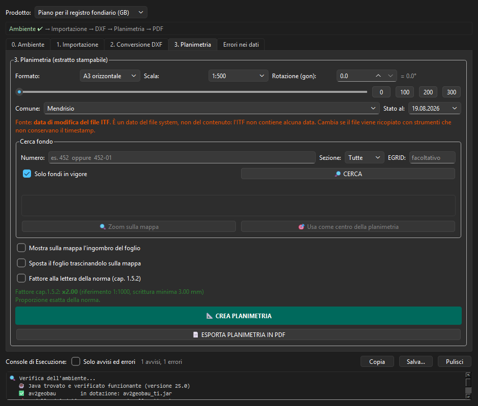
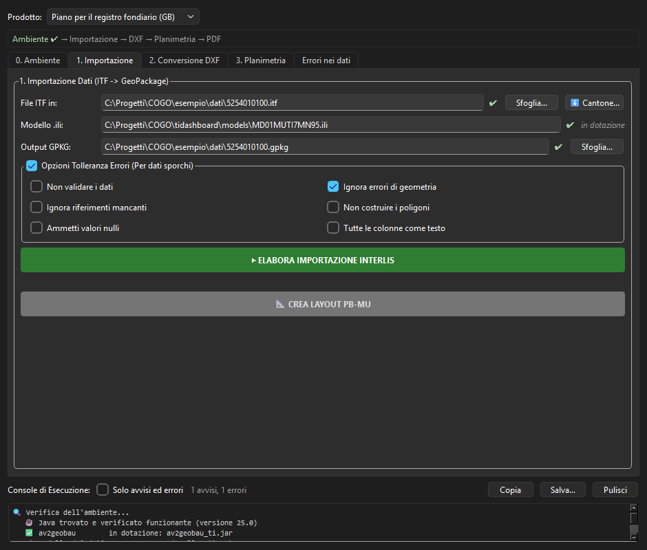
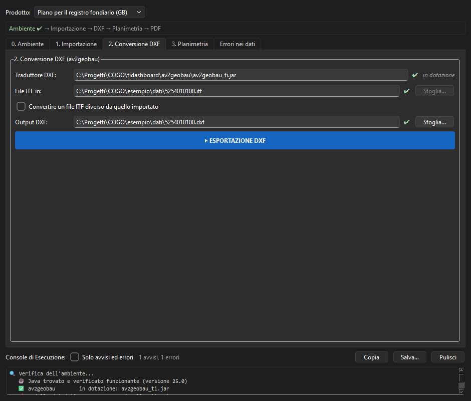

# TIDashboard


Plugin QGIS per i dati della **misurazione ufficiale svizzera**, modello ticinese
`MD01MUTI7MN95`. Importa un file INTERLIS/ITF, applica la simbologia prescritta
dalle istruzioni federali e produce planimetrie stampabili e file DXF.

> **Sperimentale.** La conformità alla norma è stata verificata sul testo delle
> istruzioni, **non** con un confronto affiancato a un estratto ufficiale né con
> una validazione dell'autorità competente. Ogni foglio prodotto riporta la
> dicitura «Riproduzione senza valore legale».



*La scheda Planimetria: formato, scala fra le otto ammesse dal cap. 1.5.1,
rotazione del foglio, ricerca del fondo e fattore di proporzionalità del
cap. 1.5.2 con il suo limite di leggibilità.*

<details>
<summary>Le altre schede</summary>



*Importazione: il modello INTERLIS è in dotazione, l'ITF si può scaricare
direttamente dal portale cantonale («Cantone...»), e ogni campo dice se il
percorso è valido prima di far partire qualcosa che dura minuti.*



*Conversione DXF: il traduttore è quello in dotazione, allineato al modello
ticinese. Il DXF prodotto viene riletto da GDAL prima di dichiarare fatto il
passo.*

</details>

## Cosa c'è qui

| | |
|---|---|
| `tidashboard/` | il plugin QGIS — è la cartella che si installa |
| `av2geobau_src/` | sorgente Java del traduttore DXF, versione adattata al modello ticinese (LGPL 2.1) |
| `crea_zip_plugin.py` | costruisce lo ZIP installabile e lo verifica |
| `.github/workflows/` | la CI: test, pacchetto con impronta, pubblicazione |

## Installazione

Serve **QGIS 4.0 o superiore** e **Java 8** o superiore installato a parte.

> ⚠️ **Non usare *Code → Download ZIP*.** Quell'archivio non è un pacchetto
> QGIS: ha sempre una cartella in più in cima, `TIDashboard-main`. QGIS usa il
> nome della cartella come nome di modulo Python, e un trattino non è un nome
> valido — l'installazione finisce con
> `ModuleNotFoundError: No module named 'TIDashboard-main/tidashboard'`.
> Non è aggiustabile da questo lato: è come GitHub confeziona quel file.
> Usare uno dei due modi qui sotto.

### 1. Dire a QGIS dove trovarlo (consigliato)

Una volta sola, in QGIS: *Estensioni → Gestisci ed installa estensioni →
Impostazioni → Aggiungi…*, un nome a piacere e questo indirizzo:

```
https://raw.githubusercontent.com/orsettobubu6-dotcom/TIDashboard/main/plugins.xml
```

Poi attivare *Mostra anche le estensioni sperimentali* (il plugin è marcato
sperimentale: senza quella spunta non compare). Da lì TIDashboard si installa
come qualunque altra estensione, e QGIS avvisa da solo quando esce una
versione nuova.

Il catalogo `plugins.xml` è **generato** da `metadata.txt` a ogni costruzione
del pacchetto, e indirizza il file del tag corrispondente: se la Release di
quella versione non esiste ancora, il download fallisce invece di servire di
nascosto un pacchetto diverso da quello dichiarato.

### 2. Scaricare il pacchetto e installarlo da ZIP

**[⬇ Ultima versione](https://github.com/orsettobubu6-dotcom/TIDashboard/releases/latest/download/tidashboard.zip)**
— oppure il file con la versione nel nome dalla pagina
[Releases](https://github.com/orsettobubu6-dotcom/TIDashboard/releases).
Poi in QGIS: *Estensioni → Gestisci ed installa estensioni → Installa da ZIP*,
sempre con *Mostra anche le estensioni sperimentali* attivo.

> Il collegamento con nome fisso esiste **dalla 1.2.2 in poi**; per le versioni
> precedenti si prende il file `tidashboard_<versione>.zip` dalla pagina delle
> Releases.

### 3. Costruirlo in locale

Serve un Python qualunque, non quello di QGIS. Lo ZIP finisce in `dist/` con
accanto il suo `.sha256`:

```bash
python crea_zip_plugin.py
```

L'archivio è riproducibile — date, permessi, fine riga **e ordine delle voci**
sono fissati apposta — quindi l'impronta di quello scaricato e quella di uno
ricostruito dallo stesso tag devono coincidere; se non coincidono, c'è qualcosa
da guardare.

> Vale **dalla 1.2.3 in poi**, e le versioni precedenti sono state dichiarate
> verificabili prima che lo fossero davvero. Fino alla 1.2.0 non erano fissati
> i fine riga; fino alla 1.2.2 non era fissato l'ordine delle voci
> nell'archivio, che dipende dal filesystem su cui lo si costruisce. Per quelle
> versioni il confronto non torna, e non è segno di manomissione.

## Documentazione

- **[tidashboard/README.md](tidashboard/README.md)** — cosa fa, come si usa, limiti noti
- **[tidashboard/NORME.md](tidashboard/NORME.md)** — documenti normativi di riferimento, con indirizzi verificati e **su quale versione** è costruita la rappresentazione
- **[tidashboard/CREDITI.md](tidashboard/CREDITI.md)** — componenti di terze parti e relative licenze
- **[CHANGELOG.md](CHANGELOG.md)** — le versioni con le loro date

## Prova

I test si eseguono con l'interprete Python di QGIS, non con uno generico:

```bash
cd tidashboard && python test_planimetria.py
```

Dieci suite. Cinque non hanno bisogno di QGIS e girano con un Python
qualunque — `test_modello`, `test_dati_comune`, `test_cerca_fondo`,
`test_scarica_mu`, `test_java_env` — le altre cinque servono l'ambiente di
QGIS: `test_planimetria`, `test_style_logic`, `test_dialog_ui`,
`test_verifica_dxf`, `test_inventario`.

## Licenza

**GPL-2.0-or-later** — vedi [LICENSE](LICENSE). È la
convenzione dei plugin QGIS ed è compatibile con i componenti LGPL 2.1
distribuiti insieme.
